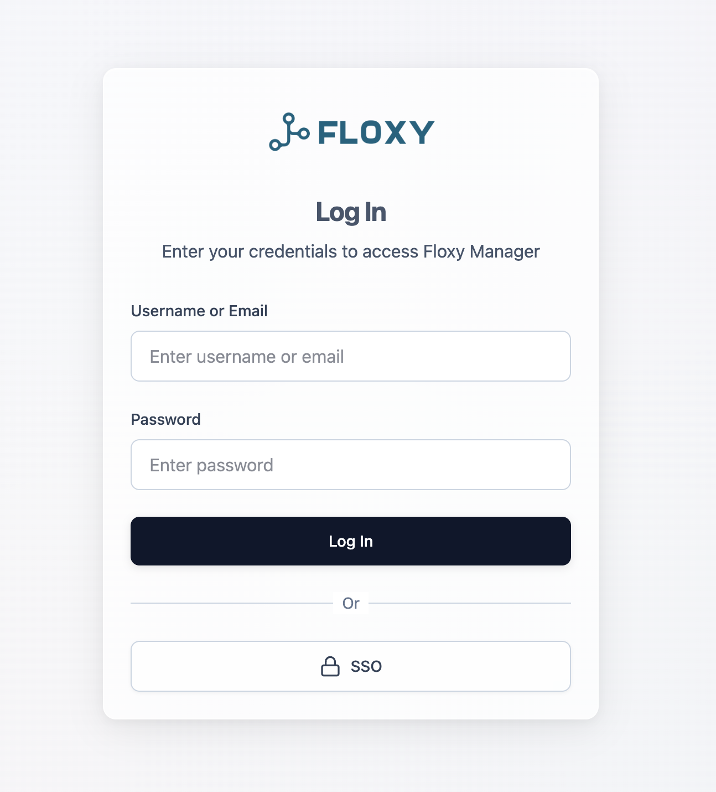
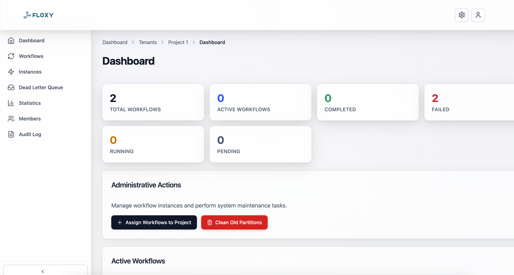
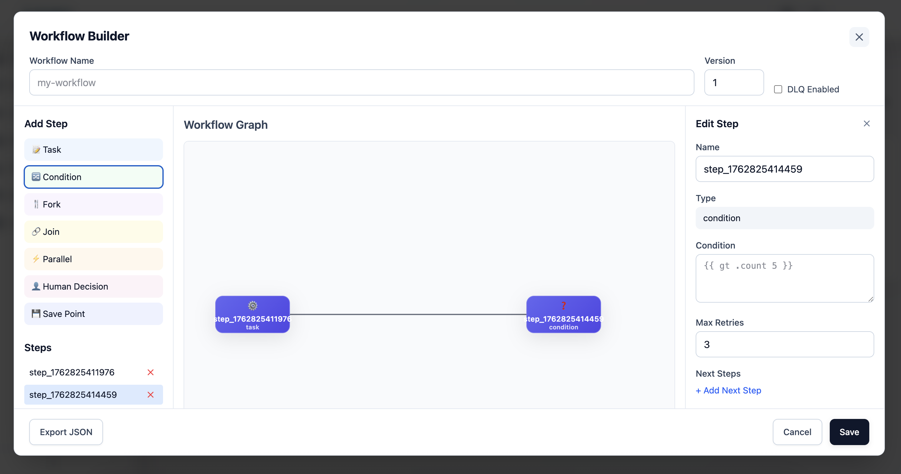
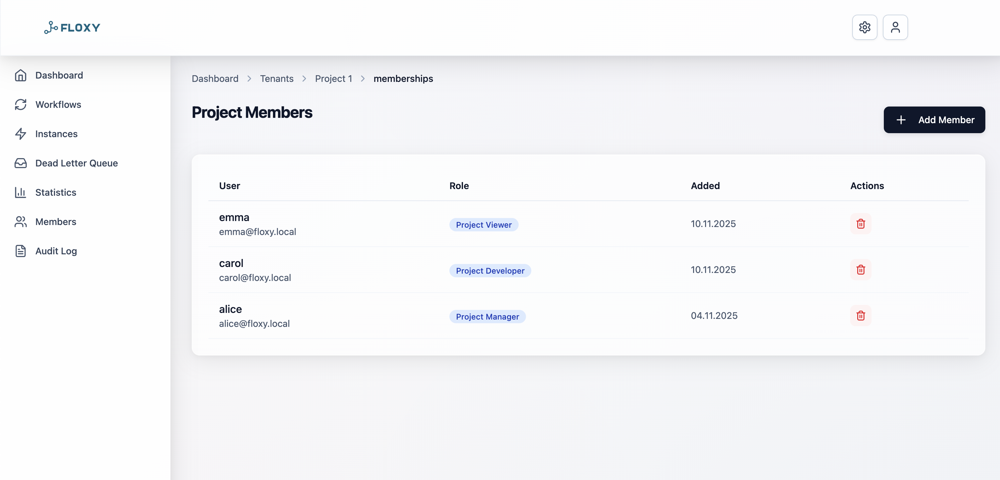

# Floxy Manager

[](https://boosty.to/dev-tools-hacker)

A modern web interface for managing Floxy workflows with Go backend and React frontend.

> Disclaimer: This app has not been tested in production yet. By using it, you are acting at your own risk.

## Installation

Floxy Manager can be installed using Docker. The Docker image is available in GitHub Container Registry:

```bash
docker pull rom8726/floxy-manager:latest
```

For more installation options, see the [Quick Start](#quick-start) section below.

## Features

### Authentication & Security

- **SSO/SAML Authentication**: Single Sign-On via SAML provider with Active Directory support. Configurable attribute mapping, automatic certificate generation, Identity Provider metadata support
- **LDAP Integration**: Full integration with LDAP/Active Directory for authentication and user synchronization. TLS/StartTLS support, connection pooling, user attribute synchronization, sync logging
- **Two-Factor Authentication (2FA)**: Two-factor authentication based on TOTP (Time-based One-Time Password). QR code generation, brute-force protection via rate limiting, email code support for 2FA disable
- **JWT Authentication**: Secure authentication based on JWT tokens with access and refresh token support, configurable token lifetime

### Access Control (RBAC)

- **Role-Based Access Control**: Flexible role-based access control system
  - Predefined roles: Project Owner, Project Manager, Project Developer, Project Viewer
  - Granular permissions at project level
  - Project membership management
  - Permission checks at API and UI level
- **Multi-Tenancy**: Multi-tenancy support with data isolation between tenants
- **Superuser Support**: Superuser support with full access to all features

### Workflow Management

- **GUI Workflow Builder**: Visual workflow editor with interactive graph
  - Drag-and-drop interface for workflow creation
  - Support for various step types: Task, Condition, Fork, Join, Parallel, Human Decision, Save Point
  - Step parameter configuration: handlers, conditions, retry policies, timeouts
  - Visualization of connections between steps
  - Export workflows to JSON format
- **Workflow Visualization**: Interactive graphs for workflow structure visualization
- **Workflow Instances**: Workflow instance management with detailed step and event viewing
- **Dead Letter Queue (DLQ)**: Queue for processing failed workflow steps with requeue capability
- **Workflow Statistics**: Real-time workflow execution statistics

### Project Management

- **Project Management**: Complete project management
  - Create, edit, and delete projects
  - Project descriptions and metadata
  - Hierarchy: Tenants → Projects → Workflows
- **Project Memberships**: Project member management with role assignment
- **Project Permissions**: Granular permissions at project level

### Audit & Monitoring

- **Audit Log**: Complete audit log of all user actions
  - Logging of create, update, delete operations
  - Project-based filtering
  - Pagination and search
- **LDAP Sync Logs**: Detailed LDAP synchronization logs with statistics
- **Metrics & Health Checks**: Prometheus metrics and health check endpoints
- **Technical Server**: Separate technical server for monitoring and debugging (pprof)

### User Management

- **User Management**: Complete user management
  - User creation and editing
  - Password management and reset
  - External user support (LDAP, SSO)
- **Email Notifications**: Email notification sending
  - Password reset
  - 2FA codes
  - Other system notifications
- **Password Management**: Secure password storage with hashing

### Additional Features

- **Settings Management**: System settings management with encryption of sensitive data
- **Dashboard**: Information dashboard with project overview and statistics
- **RESTful API**: Full REST API for all system features
- **CORS Support**: Cross-Origin Resource Sharing support
- **Transaction Management**: Database transaction management
- **Dependency Injection**: Dependency injection for component management

### Technical Features

- **Go Backend**: High-performance Go backend
- **React Frontend**: Modern TypeScript/React interface
- **Single Container**: Backend and frontend in one Docker image
- **PostgreSQL**: PostgreSQL as primary database
- **Database Migrations**: Automatic database migrations
- **Hot Reload**: Hot reload in development mode

## Screenshots

LogIn page:



Dashboard:



Workflow Builder:



Membership:



## Quick Start

### Development Mode

```bash
# Install dependencies
make install

# Start development mode (frontend + backend)
make dev
```

### Production Build

```bash
# Build everything
make build

# Run production build
make run
```

### Docker

```bash
# Build Docker image
make docker-build

# Run with Docker
make docker-run
```

## Environment Variables

### Required Variables

- `FRONTEND_URL` - Frontend URL (required, e.g., `http://localhost:3001` or `https://floxy.local`)
- `SECRET_KEY` - Secret key for encryption (required)
- `JWT_SECRET_KEY` - Secret key for JWT tokens (required)
- `API_SERVER_ADDR` - API server address (required, e.g., `:443` or `:8080`)
- `POSTGRES_HOST` - PostgreSQL host (required)
- `POSTGRES_DATABASE` - PostgreSQL database name (required)
- `POSTGRES_USER` - PostgreSQL user (required)
- `POSTGRES_PASSWORD` - PostgreSQL password (required)
- `MAILER_ADDR` - SMTP server address (required, e.g., `smtp.example.com:465`)
- `MAILER_USER` - SMTP user (required)
- `MAILER_PASSWORD` - SMTP password (required)
- `MAILER_FROM` - Email sender address (required, e.g., `noreply@example.com`)

### Optional Server Configuration

- `TECH_SERVER_ADDR` - Technical server address (default: `:8081`)
- `API_SERVER_READ_TIMEOUT` - API server read timeout (default: `15s`)
- `API_SERVER_WRITE_TIMEOUT` - API server write timeout (default: `30s`)
- `API_SERVER_IDLE_TIMEOUT` - API server idle timeout (default: `60s`)
- `API_SERVER_USE_TLS` - Enable TLS for API server (default: `false`)
- `API_SERVER_CERT_FILE` - TLS certificate file path
- `API_SERVER_KEY_FILE` - TLS private key file path
- `TECH_SERVER_READ_TIMEOUT` - Technical server read timeout (default: `15s`)
- `TECH_SERVER_WRITE_TIMEOUT` - Technical server write timeout (default: `30s`)
- `TECH_SERVER_IDLE_TIMEOUT` - Technical server idle timeout (default: `60s`)

### Database Configuration

- `POSTGRES_PORT` - PostgreSQL port (default: `5432`)
- `POSTGRES_MAX_CONNS` - Maximum database connections (default: `20`)
- `POSTGRES_MAX_IDLE_CONN_TIME` - Maximum idle connection time (default: `5m`)
- `POSTGRES_CONN_MAX_LIFETIME` - Maximum connection lifetime (default: `10m`)
- `MIGRATIONS_DIR` - Migrations directory path (default: `./migrations`)

### JWT Configuration

- `ACCESS_TOKEN_TTL` - Access token time-to-live (default: `3h`)
- `REFRESH_TOKEN_TTL` - Refresh token time-to-live (default: `168h`)
- `RESET_PASSWORD_TTL` - Password reset token time-to-live (default: `8h`)

### Admin User Configuration

- `ADMIN_EMAIL` - Admin user email (optional)
- `ADMIN_TMP_PASSWORD` - Admin user temporary password (optional)

### Mailer Configuration

- `MAILER_ALLOW_INSECURE` - Allow insecure SMTP connections (default: `false`)
- `MAILER_USE_TLS` - Use TLS for SMTP (default: `false`)
- `MAILER_CERT_FILE` - SMTP TLS certificate file path
- `MAILER_KEY_FILE` - SMTP TLS private key file path

### SAML/SSO Configuration

- `SAML_ENABLED` - Enable SAML authentication (default: `false`)
- `SAML_CREATE_CERTS` - Create SAML certificates automatically (default: `false`)
- `SAML_ENTITY_ID` - SAML entity ID
- `SAML_CERTIFICATE_PATH` - SAML certificate file path
- `SAML_PRIVATE_KEY_PATH` - SAML private key file path
- `SAML_IDP_METADATA_URL` - Identity Provider metadata URL
- `SAML_SSO_URL` - SSO URL (optional, overrides metadata)
- `SAML_ATTRIBUTE_MAPPING` - Attribute mapping (e.g., `uid:username,mail:email`)
- `SAML_SKIP_TLS_VERIFY` - Skip TLS verification (default: `false`)

### Logging

- `LOGGER_LEVEL` - Logging level (default: `info`, options: `debug`, `info`, `warn`, `error`)

## API Endpoints

- `GET /api/workflows` - List workflow definitions
- `GET /api/workflows/{id}` - Get workflow definition
- `GET /api/workflows/{id}/instances` - Get workflow instances
- `GET /api/instances` - List all instances
- `GET /api/instances/{id}` - Get workflow instance
- `GET /api/instances/{id}/steps` - Get instance steps
- `GET /api/instances/{id}/events` - Get instance events
- `GET /api/stats` - Get workflow statistics

## Architecture

```
floxy-manager/
├── cmd/server/          # Go main application
├── internal/            # Internal Go packages
│   ├── config/         # Configuration
│   └── server/         # HTTP server
├── web/                # React frontend
│   ├── src/           # TypeScript source
│   ├── public/        # Static assets
│   └── dist/          # Built frontend
└── Dockerfile         # Multi-stage Docker build
```

## Development

### Backend (Go)
- Uses the Floxy library for workflow management
- HTTP server with CORS support
- Serves static files in production
- Development mode with fallback HTML

### Frontend (React/TypeScript)
- Modern React with TypeScript
- Webpack for bundling
- Hot reload in development
- Production build optimization

## License

See LICENSE file.
